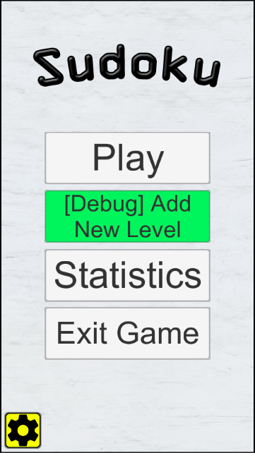
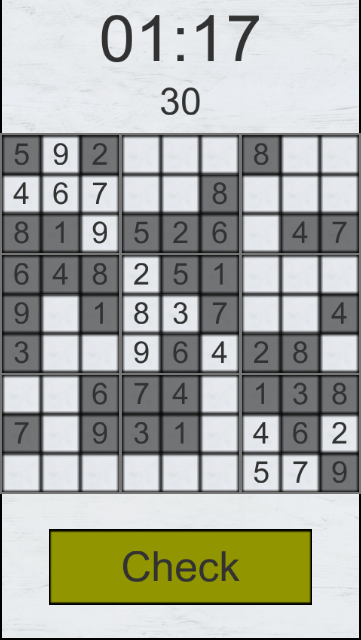
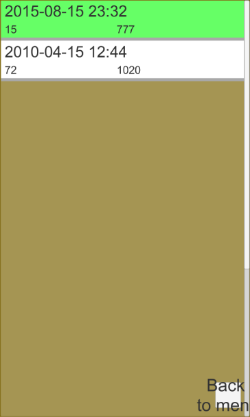
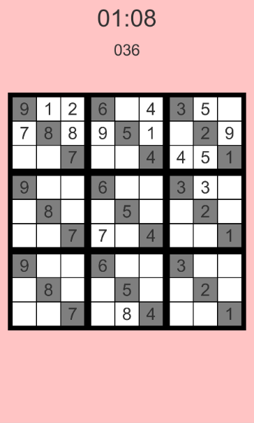
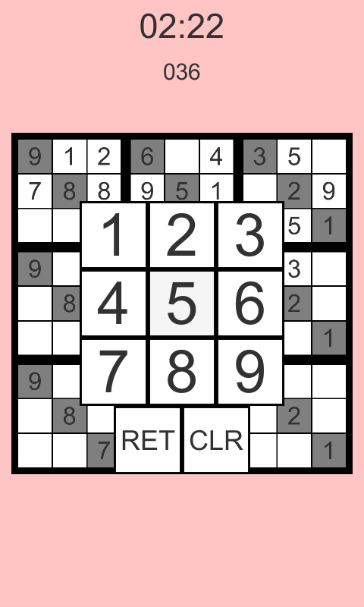
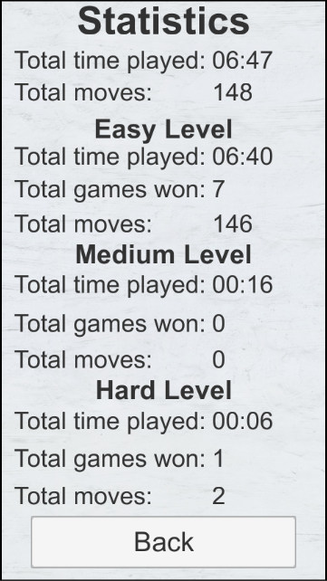
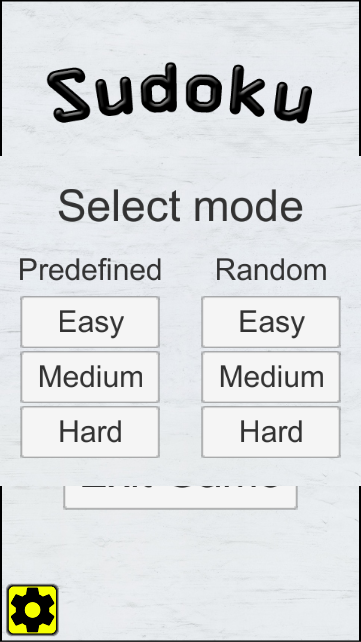
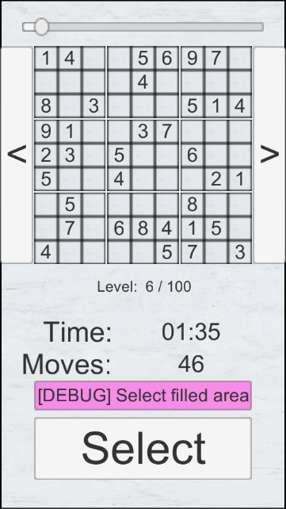

# Sudoku
Simple puzzle game <i>Sudoku</i> for Android created with Unity3D.

Used Unity3D version: 5.0.2f1

## Game
The objective is to fill a 9×9 grid with digits so that each column, each row, and each of the nine 3×3 sub-grids that compose the grid (also called "boxes", "blocks", "regions", or "sub-squares") contains all of the digits from 1 to 9.
[Wikipedia](https://en.wikipedia.org/wiki/Sudoku)

## Screenshots

        
        
        </img>
        
        </img>
        
        </img>
        
        </img>
        
        </img>
        
        </img>
        
        </img>

